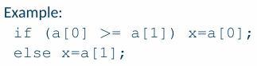
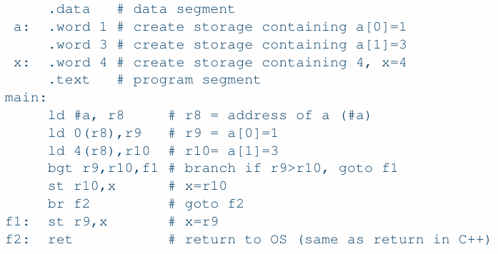
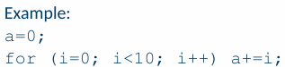
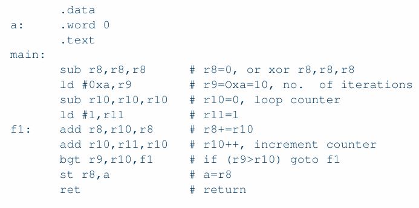
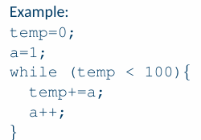
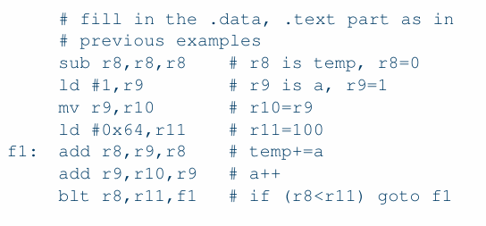
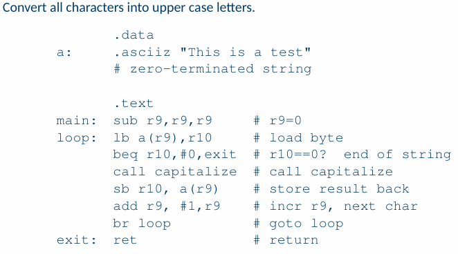
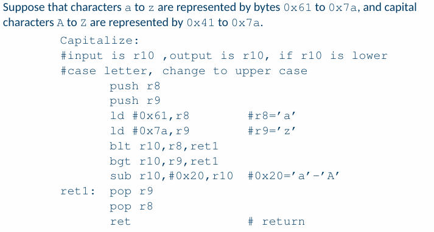

# Lec11 Assembly Language Programming

 ### High Level Languages
 + More programmer friendly()
 + More ISA(instruction set architecture) independent
 + Each high-level statement translates to several instructions in the ISA of the computer
 ### Assembly Languages
 + Lowerlevel, closer to ISA
 + Very ISA-dependent
 + One assembly language instruction is translated into one machine instruction by the assembler
 + Make slow level programming more user friendly
 + More efficient code
  
  ## Assembly Language Programming
  ### Each lines has 4 fields:
  `[label]  mnemonic  operand  list  comment`
  1. [label] (Oprional): 
     1. A label is an optional field used to identify a specific memory location or instruction.
     2. Labels are often used as references for jumps, loops, or data locations.
     3. Labels typically end with a colon (\:).
  2. Memoric:
     1. The mnemonic is the core part of the instruction, representing the operation to be performed by the CPU.
     2. Mnemonics are short, human-readable codes that correspond to machine instructions.
  3. Operand List
     1. The operand list specifies the data or addresses that the instruction operates on.
     2. Operands can include registers, memory addresses, constants, or labels.
     3. Some instructions may have no operands, one operand, or multiple operands.
     4. There are many types of rules:
        1. 立即数 (Immediate Value)
           1. Ususlly use #+value to express immediate value.
            `MOV AX, #5       # 将立即数 5 加载到寄存器 AX 中`
           2. In some assembly language, just need to use value
            `ADD CX, 10       # 将立即数 10 加到寄存器 CX 中`
        2. 寄存器 (Register)
        3. 内存地址 (Memory Address)
            1. 直接寻址 (Direct Addressing)
            `MOV AX, [1234]   # 将内存地址 1234 处的值加载到寄存器 AX 中`
            2. 间接寻址 (Indirect Addressing)
            `MOV AX, [BX]     ; 将寄存器 BX 中存储的地址指向的内存值加载到 AX 中`
            3. 基址+偏移量寻址 (Base + Offset Addressing)
            `MOV AX, [BX + SI] ; 将寄存器 BX 和 SI 的值相加作为内存地址，加载该地址的值到 AX 中`
        4. 段地址 (Segment Address)
            在某些架构（如 x86）中，内存地址分为段地址和偏移地址。
            `MOV AX, [DS:1234] ; DS 是段寄存器，1234 是偏移地址`
        5. 不同的汇编语言可能对操作数有特殊的符号或约定。以下是一些常见规则：
            1. #：表示立即数（如 #5 表示立即数 5）。
            2. []：表示内存地址（如 [1234] 表示内存地址 1234）。
            3. ()：表示偏移量（如 4(R1) 表示寄存器 R1 的值加上 4）。
            4. $：在某些汇编语言中，$ 表示立即数（如 $5 表示立即数 5）。
            5. %：在某些汇编语言中，% 表示寄存器（如 %eax 表示寄存器 EAX）。
  4. Assembler Directives   
   
    | Directives             | Description                                                                                                     |
    | ---------------------- | --------------------------------------------------------------------------------------------------------------- |
    | .data                  | Tells the assembler to add all subsequent data to the data section.                                             |
    | .text                  | Tells the assembler to add subsequent code to the text section (i.e., program section).                         |
    | .globl name            | Makes name external to other files, for multiple files in the program.                                          |
    | .space expression      | Reserves space, amount specified by the value of expression in bytes. The assembler fills the space with zeros. |
    | .word value1[, value2] | Puts the values in successive memory locations.                                                                 |\

>examples

