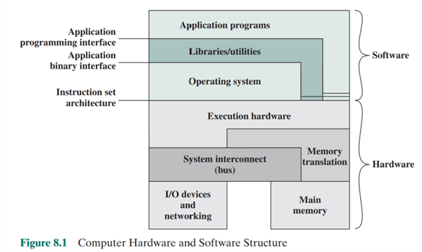

# Lec12 Operating System Support

### Services provided by OS
+ **Program Creation**  
  Provide some **utility programs** to help creating programs   
  Not actually belongs to OS, but are accessible through the OS   
  e.g.  
    + Editor (vi, emacs)
    + compiler (gcc) 
    + debugger (gdb)
+ **Program execution**      
    When executing a program, OS need to read the program from the hard disk to the main memory, prepare resources, such as process table, etc.    
    The user just need to type the program name.  
    + What OS do:  
      + Read the program from the hard disk to the main memory
      + Allocate CPU time and other resources
      + Manage the execution status of the program
+ **I/O Access**  
    + The OS provides a uniform I/O interface to the programs
    + such as:
      + open()
      + read()
      + write()
      + close()
+ **File System Management**  
  Files and diectory created, modified and stored.
+ **System Access**
  control access to the system and specific system resources, protect those resources/data from unauthorized users
+ **Error detection and response**
  Report error to programs, and their remedial action.
+ **Accounting**

## Protection Scheme
There are two main modes in OS(Some OS may have more):
+ User mode
+ Kernel(Supercisor) mode   
Some resources (such as I/O devices) or actions (some special instructions) can only be run in kernel mode, so that users will not have access to them.  
We can change from Kernel mode but can't change inverse. So we can use **System call** to excute many special program with higher privileges than user mode.  

## Multi tasking and Time-sharing System
CPU idle when I/O is performed, se we can share CPU when one process don't use CPU. We use **Time-sharing System** to do that:  
>Each process is allocated a time slice of 0.1 sec, say. When process uses up its time slice, it will stop execution, and let the next process to be executed. 
When a process cannot proceed (e.g. perform I/O), it will also stop execution   

## Vitrual Memory
### Definition:  
#### Physical Address: 
Addresses that are used to actually access the memory
#### Logical address:
Addressing space of program
After use **virtual memory**, programmer needn't manage the actually memory.
>Life is easier for the programmer

