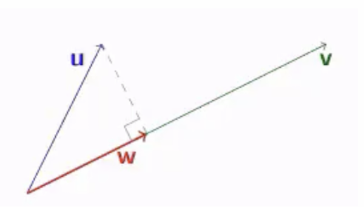

# Chapter 7 Orthogonality

Created: 2025年4月26日 10:07
Class: MATH2101

### Norm (or length) of vector:

$$
||v||=\sqrt{v^2_1+v^2_2+...+v^2_n}
$$

### Distance between $u$ and $v$:

$$
d(u,\ v)=||u-v||
$$

### Orthogonal (or perpendicular):

We say that $u$ and $v$ are orthogonal (or perpendicular) if $u · v = 0$

(i.e.  $u · v = u_1v_1 +u_2v_2 +···+u_nv_n$=0)

### Prop:

1. $u · u = ||u||^2$
2. $u · u ≥ 0$ , with equality if and only if $u = 0$
3. $u · v = v·u$
4. $u · (v +w) = u·v+u·w$
5. $(cu) · v = u·(cv)=c(u·v)$
6. $||cu|| = c||u||$

### Unit vector and normalizing:

For any non-zero vector v, consider 

$$
u=\frac{1}{||v||}v
$$

Then $||u||=1$ and is called a **unit vector**. This process is known as **normalising** the vector $v$, producing a unit vector in the same direction as $v$.

### Orthogonal projection:

 In general, the orthogonal projection of $u$ on a non-zero vector $v$ is given by:

$$
w=\frac{u\cdot v}{||v||^2}v
$$

### Pythagoras’ Theorem

For two vectors:

Two vectors $u$ and $v$ in $\mathbb{R}^n$ are **orthogonal IFF:**

$$
||u||^2+||v||^2=||u+v||^2
$$

Generally:

For $m$ vectors $v_1,\ v_2 …\ v_m$ in $\mathbb{R}^n$, they are pairwise orthogonal IFF:

$$
||v_1||^2+||v_2||^2+…+||v_m||^2=||v_1+v_2+…+v_m||^2
$$

### Cauchy-Schwarz inequality

For real numbers $u_1,u_2,...,u_n$ and $v_1, v_2,...,v_n$, we have:

$$
(u_1v_1+u_2v_2+...+u_nv_n)^2 \le (u^2_1+u^2_2+...+u^2_n)^2  (v^2_1+v^2_2+...+v^2_n)^2
$$

Equality holds IFF $\forall i\neq j, u_iv_j=u_jv_i$

For vector, we have:

For any $u,v\in \mathbb{R}^n$, we have $|u\cdot v|\le ||u||\cdot||v||$

Equality holds IFF $u\parallel v$

### Triangle inequality

 For any $v_1,v_2,...,v_k ∈\mathbb{R}^n$, we have:

$$
||v_1||+||v_2||+...+||v_k||\ge||v_1+v_2+...+v_k||
$$

## Orthogonal set

### Definition:

Let $S$ be a subset of $\mathbb{R}^n$.

(a) $S$ is said to be an **orthogonal set** if any two vectors in $S$ are orthogonal.

(b) Furthermore, if every vector in $S$ has unit length (i.e. norm 1), then $S$ is said to be an orthonormal set.

Clearly, we can get an orthonormal set by normalizing each vector of an orthogonal set.

### Orthogonal basis

In general, suppose $B = {v_1,v_2,...,v_k}$ is an orthogonal basis for a subspace $V$ of $\mathbb{R}^n$. Then for any $v ∈ V$, we have:

$$
v=\sum \frac{v\cdot v_i}{||v_i||^2}v_i
$$

Furthermore, if the basis B is orthonormal, the above expression can be simplified to:

$$
v=\sum (v\cdot v_i)v_i
$$

Prop: Every orthogonal set of non-zero vectors is linearly independent.

