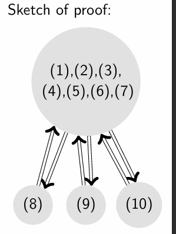

# Chapter 2 Matrices and Linear Transformations

Created: 2025年2月24日 19:04
Class: MATH2101

### A matrix with inverse is said to be invertible(or non-singular).

### Elementary matrix

An elementary matrix is a matrix obtained from the identity matrix by performing a single elementary row operation. Depending on the type of elementary row operation used to obtain it from the identity matrix, an elementary matrix can be classified as Type I, Type II, or Type III.

Specifically:

- **Type I Elementary Matrix**:
    - Corresponds to swapping two different rows.
    - For example, swapping the first row with the second row in a 3x3 identity matrix.
- **Type II Elementary Matrix**:
    - Corresponds to multiplying a row by a non-zero scalar.
    - For example, multiplying the second row of the identity matrix by a non-zero constant k.
- **Type III Elementary Matrix**:
    - Corresponds to adding a multiple of one row to another row.
    - For example, in the identity matrix, adding k times the second row to the first row (where k is any constant).

### Column Correspondence Property

Let A be a matrix and R be its reduced row echelon form.

- If certain columns of R are linearly independent, so are the corresponding columns of A, and vice versa.
- If a certain column of R is a linear combination of other columns, then the same linear relation (with the same coeffcients) holds for the corresponding columns of A, and vice versa

### Equivalent conditions about invertibility:

The following statements are equivalent for an n×n matrix A:
(1) $A$ is invertible
(2) The RREF of $A$ is $I$.
(3) The span of the columns of $A$ is $\mathbb{R}^n$ 
(4) $rank(A)=n$.(i.e. $nullity(A)=0$)
(5) $Ax=b$ is consistent for every $b∈\mathbb{R}^n$ 
(6) The columns of $A$ are linearly independent.
(7) $Ax=0$ only has the trivial solution.
(8) There exists a matrix $B$ such that $BA=I$.
(9) There exists a matrix $C$ such that $AC=I$.
(10) $A$ is a product of elementary matrices.
(11) $det(A)\neq0$

The way to prove it:

### LU Decomposition

LU decomposition of A is a factorization of the form A=LU in which L is a unit lower triangular (square) matrix (i.e. all entries on the diagonal are 0) and U is upper triangular (not necessarily square).

e.g. 

### Indeed, not all matrices have LU decomposition.

### PLU Decomposition

When a matrix hasn’t LU decomposition, we can find an invertible permutation matrix P, so that $P^(-1)A$ has LU decomposition.

$$
P^{-1}A=LU\\
A=PLU
$$

As addition, because permutation matrix is an orthogonal Matrix, so we have:

$$
P^{-1}=P^T
$$

### matrix Transformation

Let A be an m×n matrix. The function:

$$
T_a:\ R^n\rightarrow R^m\\
defined\ by\ T_a(x)=Ax
$$

is said to be the matrix transformation induced by A (such A is called the standard matrix of T).

### Composition of T

### Common geometric transformation
#### (1) Reflection on x/y - axis
$$\begin{pmatrix}
    x\\
    y
\end{pmatrix}
\Rightarrow
\begin{pmatrix}
    x\\
    -y
\end{pmatrix}
\ or\ 
\begin{pmatrix}
    -x\\
    y
\end{pmatrix}
$$

just multiply following matrix:
$$
\begin{pmatrix}
    1 & 0\\
    0 & -1
\end{pmatrix}
\ or\ 
\begin{pmatrix}
    -1 & 0\\
    0 & 1
\end{pmatrix}
$$
#### (2)Translation upward by 1 unit
Not exist a linear transformation for it

#### (3)Enlargement about the origin by a factor of $k$
$$
\begin{pmatrix}
    x\\
    y
\end{pmatrix}\Rightarrow
\begin{pmatrix}
    kx\\
    ky
\end{pmatrix},\ k\in \mathbb{R}
$$
just multiply following matrix:
$$
\begin{pmatrix}
    k & 0\\
    0 & k
\end{pmatrix}
$$
......

### Injectivity and surjectivity

### Null space of T (aka null space of A,  kernel of T)

The preimage of {0}, i.e. the set of all v such that T(v)=0 is called the null space of T.

### Some property:

$$
T(u+c)=T(u)+T(c)\\
T(ku)=kT(u)
$$

  A transformation T  is linear if and only if it is a matrix transformation.