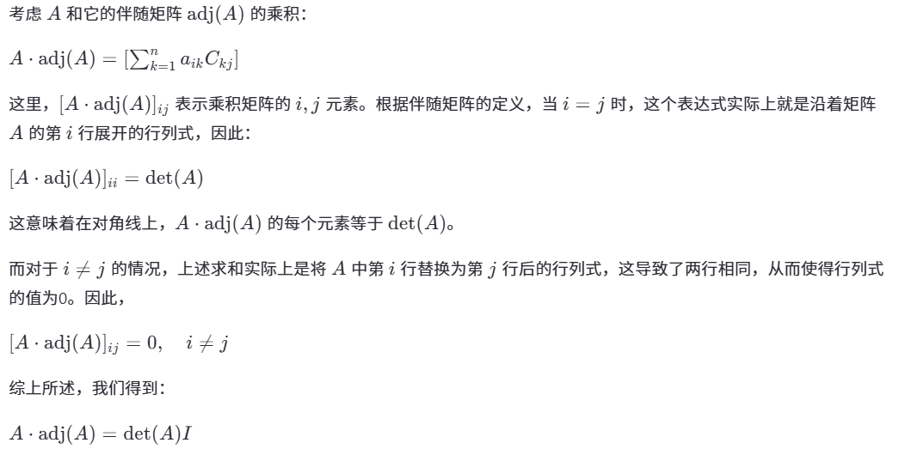

# Chapter 3 Determinants

Created: 2025年3月2日 14:21
Class: MATH2101

### Definition of Determinant:

Let A = $[a_{ij}]$ be an $n\times n$ matrix.

$A_{ij}$ is a submatrix of A that obtained by deleting the  $i-th$ row and $j-th$ column.

$C_{ij}$ is (i, j)-cofactor, defined by 

$$
C_{ij}=(-1)^{i+j}\times det(A_{ij})
$$

So we have:

$$
det(A)=\sum^{n}_{i=1}a_{mi}\times C_{mi}\ \ \ or\ \ \  \sum^{n}_{i=1}a_{im}\times C_{im}\\
m\in \{1,2,3...n\}
$$

Knowns as “The cofactor expansion along the $m-th$ row/column”

### Simplification of evaluating the determinant

- Find the tow/column that with more zero.
- The determinant of the triangular matrix, is equal to the product of the non-zero matrix.
    - $det\left(\begin{matrix}A_{11} & * & {…} & *\\0 & A_{22} & {…} & * \\ {…} & {…} & {… } & {…}\\ 0 & 0 & 0 & A_{nn} \end{matrix}\right)=\prod^n_{i=1}A_{ii}$
    - Generalized, if each $A_{ii}$ is a block matrix, then we have:
        - $det\left(\begin{matrix}A_{11} & * & {…} & *\\0 & A_{22} & {…} & * \\ {…} & {…} & {… } & {…}\\ 0 & 0 & 0 & A_{nn} \end{matrix}\right)=\prod^n_{i=1}det(A_{ii})$
- ERO’s effect on determinant:
    - Type 1 EROs—Exchange two rows
        - $det(E_1A)=(-1)\times det(A)$
    - Type 2 EROs—Multiply one row by a constant k:
        - $det(E_2A)=k\times det(A)$
    - Type 3 EROs—Add a row to another row:
        - $det(E_3A)=det(A)$
    - Essentially, that is because:
        - $det(EA)=det(E)\times det(A)$

### Properties of determinants

 Let A be a square matrix. Then

- A is invertible if and only if $det(A)\ne 0$
- $det(AB)=det(A)\times det(B)$(if they have the same size)
- $det(A^T)=det(A)$
- $det(A^{-1})=\frac{1}{det(A)}$
- Let T : $R^n\rightarrow R^n$ be an invertible linear transformation with standard matrix A. Then for any “sufficiently nice region” S in $R^n$(Usually refers to the region that can calculate the volumn), the n-dimensional volume of T(S) is equal to $|det(A)|$ times the n-dimensional volume of S.

### Use determinant to solve the inverse matrix.

The adjoint of A, denoted by $adj(A)$.

$adj(A)=[C_{ij}]$

then we have:

$A^{-1}=\frac{1}{det(A)}\times adj(A)$

- proof
    
    $$
    \begin{split}&det(A)\times det\left(\frac{1}{det(A)}\times adj(A)\right)\\
    &=det\left(A\ adj(A)\right)\times \frac{1}{det(A)}\\
    &=det(\left[\sum^n_{k=1} a_{ik}\times C_{kj}\right])\times \frac{1}{det(A)}\\
    &=det(A)\times \frac{1}{det(A)}\\
    &=1\end{split}
    $$
    
    
    

### Use determinant to solve linear equation

Cramer’s rule:

We have Ax=b

so $\vec{x}=A^{-1}\vec{b}=\frac{1}{det(A)}\times det(adj(A))\times \vec{b}$

Let $A_i$ denote the $i-th$ column of A

then we have:

$$
x_i=\frac{det([\vec{A_1}\ {...}\    \vec{A_{i-1}}\ \vec{b}\ \vec{A_{i+1}}\ {...}\ \vec{A_n}])}{det(A)}
$$