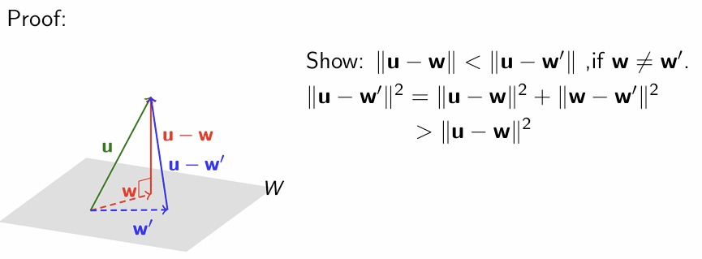

# Chapter 7 Orthogonality

Created: 2025年4月26日 10:07
Class: MATH2101

### Norm (or length) of vector:

$$
||v||=\sqrt{v^2_1+v^2_2+...+v^2_n}
$$

### Distance between $u$ and $v$:

$$
d(u,\ v)=||u-v||
$$

### Orthogonal (or perpendicular):

We say that $u$ and $v$ are orthogonal (or perpendicular) if $u · v = 0$

(i.e.  $u · v = u_1v_1 +u_2v_2 +···+u_nv_n$=0)

### Prop:

1. $u · u = ||u||^2$
2. $u · u ≥ 0$ , with equality if and only if $u = 0$
3. $u · v = v·u$
4. $u · (v +w) = u·v+u·w$
5. $(cu) · v = u·(cv)=c(u·v)$
6. $||cu|| = c||u||$

### Unit vector and normalizing:

For any non-zero vector v, consider 

$$
u=\frac{1}{||v||}v
$$

Then $||u||=1$ and is called a **unit vector**. This process is known as **normalising** the vector $v$, producing a unit vector in the same direction as $v$.

### Orthogonal projection:

 In general, the **orthogonal projection** of $u$ on a non-zero vector $v$ is given by:

$$
w=\frac{u\cdot v}{||v||^2}v
$$

### Pythagoras’ Theorem

For two vectors:

Two vectors $u$ and $v$ in $\mathbb{R}^n$ are **orthogonal IFF:**

$$
||u||^2+||v||^2=||u+v||^2
$$

#### Generally:

For $m$ vectors $v_1,\ v_2 …\ v_m$ in $\mathbb{R}^n$, they are pairwise orthogonal IFF:

$$
||v_1||^2+||v_2||^2+…+||v_m||^2=||v_1+v_2+…+v_m||^2
$$

### Cauchy-Schwarz inequality

For real numbers $u_1,u_2,...,u_n$ and $v_1, v_2,...,v_n$, we have:

$$
(u_1v_1+u_2v_2+...+u_nv_n)^2 \le (u^2_1+u^2_2+...+u^2_n)^2  (v^2_1+v^2_2+...+v^2_n)^2
$$

Equality holds IFF $\forall i\neq j, u_iv_j=u_jv_i$

For vector, we have:

For any $u,v\in \mathbb{R}^n$, we have $|u\cdot v|\le ||u||\cdot||v||$

Equality holds IFF $u\parallel v$

### Triangle inequality

 For any $v_1,v_2,...,v_k ∈\mathbb{R}^n$, we have:

$$
||v_1||+||v_2||+...+||v_k||\ge||v_1+v_2+...+v_k||
$$

## Orthogonal set

### Definition:

Let $S$ be a subset of $\mathbb{R}^n$.

(a) $S$ is said to be an **orthogonal set** if any two vectors in $S$ are orthogonal.

(b) Furthermore, if every vector in $S$ has unit length (i.e. norm 1), then $S$ is said to be an orthonormal set.

Clearly, we can get an orthonormal set by normalizing each vector of an orthogonal set.

### Orthogonal basis

In general, suppose $B = {v_1,v_2,...,v_k}$ is an orthogonal basis for a subspace $V$ of $\mathbb{R}^n$. Then for any $v ∈ V$, we have:

$$
v=\sum \frac{v\cdot v_i}{||v_i||^2}v_i
$$

Furthermore, if the basis B is orthonormal, the above expression can be simplified to:

$$
v=\sum (v\cdot v_i)v_i
$$

Prop: Every orthogonal set of non-zero vectors is linearly independent.  

### *Gram Schmidt* process
Suppose $\{u_1, u_2, ... u_k\}$ is a basis for a subspace $W$ of $\mathbb{R}^n$. The ***Gram Schmidt*** process turns this basis into an orthogonal basis $\{v_1, v_2, ... v_n\}$ by:   
$$
\begin{align*}
& v_1=u_1 \\ 
& v_i=u_i-\sum_{k=0}^{i-1}\frac{u_i\cdot v_k}{||v_k||}v_k\ for\ 2\le i\le k
\end{align*}
$$  
### Orthogonal Complement of S:
#### Definition:
Let $S$ be a subset of $\mathbb{R}^n$.  
The ***Orthogonal complement*** of $S$,  denoted by $S^\perp$ is the set of vectors in $\mathbb{R}^n$ that are orthogonal to every vector in $S$.  
i.e.  
$$S^\perp = \{v\in \mathbb{R}^n:\forall u\in S,\ v\cdot u=0\}$$
#### prop:
1. Let $S$ be a subset of $\mathbb{R}^n$, then $S^\perp$is a subspace of $\mathbb{R}^n$.
2. Let $S$ be a finite subset of $\mathbb{R}^n$. Then $S^\perp = (Span\ S)^\perp$
3. Let $A$ be a matrix.Then$(Row\ A)^⊥=Null\ A$. (Here we identify the row vectors in $Row\ A as column vectors in the natural way.)  
###  Orthogonal Decomposition Theorem
#### Definition
 Let $W$ be $a$ subspace of $\mathbb{R}^n$.  
 Then every vector $u$ in $\mathbb{R}^n$ can be written in the form $u = w+z$ where $w ∈ W$ and $z∈W^⊥$ in a unique way.  
#### prop:
 1. $dim\ W+dim\ W^\perp =n$
 2. $B \cup B'$is a  basis for $\mathbb{R}^n$, where $B$ is a basis for $W$ and $B'$ is a basis for $W^\perp$.
 ### Orthogonal Projection
 Let $W$ be a subspace of $\mathbb{R}^n$. The ***orthogonal projection*** function
 $U_W$ :$\mathbb{R}^n →\mathbb{R}^n$ is a linear transformation. The standard matrix $P_W$ of $U_W$ is given by:  
 $P_W=C(C^TC)^{-1}C^T$, where $C$ is a matrix whose columns form a basis for $W$.  
 And we have:  
 Let $C$ be a matrix whose columns are linearly independent. Then $C^TC$ is invertible.
 #### prop:
$U_W(u)$ is the vector in $W$ that is closest to $u$.  
## Least Squares Fitting:
There are $n$ points $(x_1,y_1),(x_2,y_2),...,(x_n,y_n)$ on the plane.We use square deviation $E$ to describe the fitting level of the straight line $y=a_0+a_1x$:  
$$\begin{align*}
    E&=\sum^n_{i=1}[y_i-(a_0+a_1x_i)]^2\\
    &=
    \begin{Vmatrix}
        \begin{bmatrix}
            y_1-(a_0+a_1x_1)\\
            y_2-(a_0+a_1x_2)\\
            \vdots\\
            y_n-(a_0+a_1x_n)\\
        \end{bmatrix}
    \end{Vmatrix}^2\\
    &= ||\mathbf{y}-(a_0\mathbf{1}+a_1\mathbf{x})||^2
\end{align*}$$
Hence we want to look for the vector in $Span\{1,x\}$ that is closest to $\mathbf{y}$, 
 naturally, we consider the orthofonal projection. 

 >根据线性代数理论, $y$ 在子空间$Span\{1,x\}$上的正交投影是最小化误差$||\mathbf{y}-\mathbf{p}||$的唯一解  

More generally, finding the 'Least Squares Fitting' is equivalent to finding the 'best approximation' of $A\mathbf{x}=\mathbf{b}$, where:
$$A=
\begin{bmatrix}
    1 & x_1\\
    1 & x_2\\
    . & .\\
    . & .\\
    . & .\\
    1 & x_n\\
\end{bmatrix},
\ \mathbf{b}=
\begin{bmatrix}
    y_1\\
    y_2\\
    .\\
    .\\
    .\\
    y_n\\
\end{bmatrix},
\ \mathbf{x}=
\begin{bmatrix}
    a_0\\
    a_1\\
\end{bmatrix}
$$

 It's equivalent to the 'best approximate solution' $\mathbf{z}$ so that $A\mathbf{z} = \mathbf{b}^′$ is as close to $\mathbf{b}$ as possible. This amounts to solving the equation $A\mathbf{z} = \mathbf{b}^′$ where \mathbf{b}^′$ is the orthogonal projection of $\mathbf{b}$ on $Col\ A$. There are two cases:
1. There are infinitely solutions of $A\mathbf{x}=\mathbf{b}$
   The form of the solution can be
   $$\mathbf{x}=\mathbf{x_0}+\mathbf{z}$$
   where $x_0$ is a **particular solution** of the linear equation   
   $z$ is the **general solution** of the linear equation($Az=\mathbf{0}$, i.e. $z\in Null(A)$)  
   We want to find the least norm solution, which means the $\mathbf{z}$ is clost to $\mathbf{0}$ 
2. There are no solution of $A\mathbf{x}=\mathbf{b}$   
   So there also be infinitely many best approximate solutions to $A\mathbf{x} = \mathbf{b}^′$

