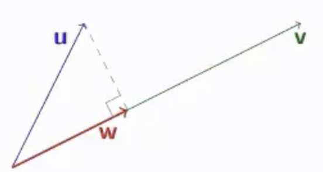
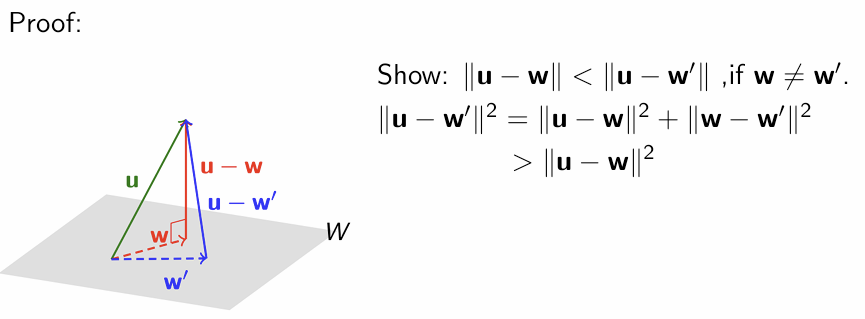

# cheatsheet
## PART1: definition
### 1. Triangular matrix:   

A matrix that only upper or lower triangular entry is non-zero.
&emsp;A matrix is **upper triangular** if the (i j)-entry is 0 whenever $i>j$.
&emsp;A matrix is **lower triangular** if the (i j)-entry is 0 whenever $i<j$.

### 2. **Diagonal matrix:**
A square matrix that both upper and lower triangular
(i.e. Only diagonal entries is non-zero)  

### 3. **Standard vectors**
A vector in whose only i-th entry is 1 is denoted by $e_i:\ e_1, e_2, ..., e_n$ are collectively known as the **standard vectors** $e_i$  
(also called **standard unit vectors** or **standard basis vectors**) 

### 4. **Identity Matrix I**:
A matrix that only diagonal entries are $1$, others are all $0$.

### 5. Equicalent 
The two systems are **equivalent** if they have the same solution set.

### 6. **Augmented matrix**:
We append RHS constants vector to coefficient matrix, written as the following form: $ [A\ |\ b] $

### 7. **EROs**: **elementary row operations**
(I) **Exchange** two rows
(II) **Multiply** a row by a nonzero constant
(III) **Add** a multiple of a row to another row

### 8. **REF row echelon matrix:**
(1)  Zero rows must be at the bottom of the matrix (if any)
(2) The **leading entry** (i.e. first non-zero entry, also called **pivot**) of non-zero row must be on the right of the leading entries in the rows above (i.e. the entries below a leading entry must be 0)
We call it is in **row echelon form (REF)**

### 9. **RREF reduced row echelon matrix:**
(3) The column that each leading entry in only has one non-zero entry (i.e. pivot itself)
(4) Every leading entry of non-zero rows are 1
We call it is in **reduced** **row echelon form (RREF)**, or **row canonical form**

### **Inconsistent:**
If there is a linear system with no solution at all, it’s **inconsistent.**
&emsp;i.e. It's RREF has $[0\ 0\ ...\ 0\ |\ 1]$

### 10. **Rank** and **Nullity**:
&emsp;The **rank** of $A$ (denoted by **$rank(A)$**) is the number of **pivots** in the RREF of  $A$(also the REF of $A$)
&emsp;The **nullity** of $A$ (denoted by **$nullity(A)$**) is defined to be the number of **free variables** in the solutions of $Ax=0$

### 11. **Span** and **Generation set**:
Let $S$ be a finite non-empty set of vectors in $\mathbb{R}^n$, the **span** of $S$ (denoted by **$span(S)$**) is defined to be the set of all linear combinations of the vectors in S
And S is called the **generation set** of $span\{s\}$;

### 12. Elementary matrix
An **elementary matrix** is a matrix obtained from the identity matrix by performing a **single ERO**.
Specifically:
- **Type I Elementary Matrix**:
    - Corresponds to **swapping** two different rows.
    - e.g. swapping the first row with the second row in a 3x3 identity matrix.
- **Type II Elementary Matrix**:
    - Corresponds to **multiplying** a row by a non-zero scalar.
    - e.g. multiplying the second row of the identity matrix by a non-zero constant k.
- **Type III Elementary Matrix**:
    - Corresponds to **adding** a multiple of one row to another row.
    - e.g. in the identity matrix, adding k times the second row to the first row (where k is any constant).

### 13. LU Decomposition
LU decomposition of $A$ is a factorization of the form $A=LU$ in which $L$ is a unit lower triangular (square) matrix (i.e. all entries on the diagonal are 0) and $U$ is upper triangular (not necessarily square).    

$$A = 
\begin{bmatrix}
    2 & 1 \\
    4 & 3
\end{bmatrix}=
\begin{bmatrix}
    1 & 0 \\
    2 & 1
\end{bmatrix}
\begin{bmatrix}
    2 & 1 \\
    0 & 1
\end{bmatrix}
= LU
$$

$$其中：
L = 
\begin{bmatrix}
1 & 0 \\
2 & 1
\end{bmatrix},
\quad
U = 
\begin{bmatrix}
2 & 1 \\
0 & 1
\end{bmatrix}
$$

### 14. PLU Decomposition

When a matrix **hasn’t LU decomposition**, we can find an **invertible** permutation matrix $P$, so that $P^(-1)A $ has LU decomposition.

$$
P^{-1}A=LU\\
A=PLU
$$

As addition, because permutation matrix is an **Orthogonal Matrix**, so we have:

$$
P^{-1}=P^T
$$

### 15. Matrix Transformation
Let A be an m×n matrix. The function:
$$
T_a:\ R^n\rightarrow R^m\\
defined\ by\ T_a(x)=Ax
$$
is said to be the matrix transformation induced by A (such A is called the standard matrix of T).

### 16. Linear Transformation
A function $T : \mathbb{R}^n → \mathbb{R}^m$ is said to be a linear transformation if 
$$
T(u+v) =T(u)+T(v)\\
and\\
T(cu) = cT(u)
$$
for any $u,v \in \mathbb{R}^n$ and $c\in \mathbb{R}$, 
&emsp;i.e. $T$ **preserves** addition and scalar multiplication.

### 17. Injectivity and surjectivity
Let $T : \mathbb{R}^n →\mathbb{R}^m$ be a **linear transformation** with standard matrix $A$. Then:
(a) $T$ is **injective** if and only if $rankA = n$ (equivalently, T has null space{0} ).
(b) $T$ is **surjective** if and only if $rankA = m$.

### 18. Null space of T (aka null space of A,  kernel of T)
The **preimage**(原像) of $\{0\}$
&emsp;i.e. the set of all $v$ such that $T(v)=0$ is called the **null space** of $T$.

### 19. cofactor
Let A = $[a_{ij}]$ be an $n\times n$ matrix.
&emsp;$A_{ij}$ is a submatrix of A that obtained by deleting the  $i-th$ row and $j-th$ column.
&emsp;$C_{ij}$ is (i, j)-cofactor, defined by 
$$
C_{ij}=(-1)^{i+j}\times det(A_{ij})
$$

### 20. Determination
For an $n\times n$ matrix $A=[a_{ij}]$,  we define:
$$
detA=\sum^n_{i=1}a_{ij}\cdot C_{ij}\ or\ \sum^n_{j=1}a_{ij}\cdot C_{ij}\\
where\ i, j \in \mathbb{R}
$$
Knowns as “The **cofactor expansion** along the **j-th column** or **i-th row**”

### 21. adjoint
The adjoint of $A$, denoted by $adj(A)$.
$adj(A)=[C_{ij}]$

### 22. Subspace
A subset $W\subseteq \mathbb{R}^n$ is said to be a ***subspace*** of $\mathbb{R}^n$ if it satisfies the following:
- $\vec{0}\in W$
- If $\vec{x},\vec{y}\in W$, then $\vec{x}+\vec{y}\in W$(i.e. W is closed under addition)
- If $\vec{x}\in W$and $c\in \mathbb{R}$, then $c\vec{x}\in W$(i.e. W is closed under scalar multiplication)

## For each $m\times n$ matrix $A$, we have:

### 23. Row space

Notion: $Row\ A$

Subspace of $\mathbb{R}^n$

**Span** of the rows of $A$

### 24. Column space

Notion: $Col\ A$

Subspace of $\mathbb{R}^m$

**Span** of the columns of $A$

### 25. Null space

Notion: $Null\ A$

Subspace of $\mathbb{R}^n$

**Solution set** of $A\vec{x}=0$

### 26. Basis:

Let $V$ be a subspace of $\mathbb{R}^n$. A linearly independent generating set for $V$ is called a basis for $V$.
Remarks:
- The plural for basis is ***bases***. (单词basis的复数形式是bases)
- A basis for V must be a subset of V.
- Every basis for $\mathbb{R}^n$ consists of exactly $n$ vectors.

### 27. **Reduction Theorem (约简定理) and Extension Theorem (扩展定理):**
Let $V$ be a non-zero subspace of $\mathbb{R}^n$. We have the following:
- (Reduction theorem) Every finite generating set of $V$ contains a basis.
- (Extension theorem) Every linearly independent subset of $V$ can be extended to a basis.  
(By convention we say that only basis of the zero subspace is the empty set.)

### 28. Dimension
Any two bases for $V$ contain the **same number** of vectors. This number is said to be the **dimension of $V$** and is denoted by $dim(V)$.
(By convention the **zero subspace** is defined to have **dimension 0**.)

### 28. Coordinate vector:
#### lemma:
Let $B =\{b_1,b_2...b_k\}$ be an ***ordered basis*** for a subspace V.
Then each $v\in V$ can be written as a unique linear combination of the vectors in $B$.
In the forms as:
$$
 v =c_1b_1 +c_2b_2 +...+c_kb_k
$$
#### Hence we define :
$$
[v]_B=\begin{bmatrix}c_1\\c_2\\c_3\\…\\c_k\end{bmatrix}=B^{-1}v
$$
to be the ***coordinate vector of v relative to B*** (or ***B-coordinate vector of v***).

## 29. Similarity of matrices
Let $A$ and $B$ be square matrices. We say $A$ is **similar** to $B$ if
$$
B=P^{−1}AP
$$
for some invertible matrix $P$.
Thus in some sense, **similar matrices** can be seen as **matrices representing the same linear transformation with respect to different bases**.

### 30. eigenvalue, eigenvactor and eigenspace
Let $A$ be a square matrix. If $Ax=\lambda x$ for some non-zero vector $x$ and scalar $t$
$\lambda $ is called to be an **eigenvalue** of $A$ ;
$x$ is called an **eigenvector** of $A$ corresponding to the eigenvalue ,or in short, a of $A$.
and we call $Null(A-\lambda I)$ as *eigenspace* of $A$ corresponding of $\lambda$, or in shorter, the $\lambda-eigenspace$ of $A$

### 31. character equation and character polynomial
In the progess of finding the eigenvalue, we define **character equation** is:
$$
det(A-\lambda I)=0
$$
and character polynomial is LHS:
$$det(A-\lambda I)$$

### 32. Algebraic multiplicity and geometric multiplicity
#### lemma:
&emsp;A degree $n$ polynomial (where $n>1$) with coefficients in $\mathbb{C}$ has exactly $n$ zeros(零点) in $\mathbb{C}$ (counting multiplicities，重根). 
&emsp;It thus follows that a $n×n$ matrix $A$ has exactly $n$ eigenvalues in  $\mathbb{C}$ (counting multiplicities)
- The ***algebraic multiplicity*** (or simply ***multiplicity***) of an eigenvalue is the number of times it appears as a zero of the character polynomial.
- The ***geometric multiplicity*** of an eigenvalue is the dimension of its corresponding eigenspace.

### 33. Diagonalization(对角化)
#### diagonalizable:
An $n\times n$ matrix $A$ is **diagonalizable** IFF it has $n$ **linear independent** eigenvectors.
  - Eigenvectors of a matrix $A$ that correspond to distinct eigenvalues are linearly independent.
- If a matrix $A$ has an eigenvalue whose geometric multiplicity is less than the algebraic multiplicity, then $A$ is not diagnosable.    

Thus, A matrix $A$ is diagonalizable if and only if for each of its eigenvalues, the algebraic and geometric  multiplicities are equal.
#### Process
If $A$ is a diagonalizable $n\times n$ matrix, it has $n$ **eigenvalues**:$\{\lambda_1, \lambda_2, ... \lambda_n\}$ and $n$ **corresponding linear independent eigenvectors**:$\{v_1, v_2, ... v_n\}$
$$
(i.e. \forall i\in\mathbb{R}\ Av_i=\lambda_i v_i)
$$
Then we have:
$$A=PDP^-1$$
where $P$ is **eigenvector matrix** and $D$ is **diagonal matrix of eigenvalues**
$$P=
\begin{bmatrix}
v_1 & v_2 & \cdots & v_n
\end{bmatrix},\ 
D=\begin{bmatrix}
\lambda_1 & 0 & \cdots & 0\\
0 & \lambda_2 & \cdots & 0\\
\cdots & \cdots & \cdots & \cdots\\
0 & 0 & \cdots & \lambda_n\\
\end{bmatrix}
$$

### 34. Norm (or length) of vector:
$$
||v||=\sqrt{v^2_1+v^2_2+...+v^2_n}
$$

### 35. Distance between $u$ and $v$:
$$
d(u,\ v)=||u-v||
$$

### 36. Orthogonal (or perpendicular):
We say that $u$ and $v$ are orthogonal (or perpendicular) if $u · v = 0$
(i.e.  $u · v = u_1v_1 +u_2v_2 +···+u_nv_n$=0)

### 37. Unit vector and normalizing:
For any non-zero vector v, consider 
$$
u=\frac{1}{||v||}v
$$
Then $||u||=1$ and is called a **unit vector**. This process is known as **normalising** the vector $v$, producing a unit vector in the same direction as $v$.

### 38. Orthogonal projection and orthogonal projection:
In general, the **orthogonal projection** of $u$ on a non-zero vector $v$ is given by:
$$
w=\frac{u\cdot v}{||v||^2}v
$$

Let $W$ be a subspace of $\mathbb{R}^n$. The ***orthogonal projection*** function
$U_W$ :$\mathbb{R}^n →\mathbb{R}^n$ is a linear transformation. The standard matrix $P_W$ of $U_W$ is given by:  
$P_W=C(C^TC)^{-1}C^T$, where $C$ is a matrix whose columns form a basis for $W$.  
And we have:  
Let $C$ be a matrix whose columns are linearly independent. Then $C^TC$ is invertible.

### 39. Pythagoras’ Theorem
For two vectors:
Two vectors $u$ and $v$ in $\mathbb{R}^n$ are **orthogonal IFF:**
$$
||u||^2+||v||^2=||u+v||^2
$$
#### Generally:
For $m$ vectors $v_1,\ v_2 …\ v_m$ in $\mathbb{R}^n$, they are pairwise orthogonal IFF:
$$
||v_1||^2+||v_2||^2+…+||v_m||^2=||v_1+v_2+…+v_m||^2
$$

### 40. Cauchy-Schwarz inequality
For real numbers $u_1,u_2,...,u_n$ and $v_1, v_2,...,v_n$, we have:
$$
(u_1v_1+u_2v_2+...+u_nv_n)^2 \le (u^2_1+u^2_2+...+u^2_n)^2  (v^2_1+v^2_2+...+v^2_n)^2
$$
Equality holds IFF $\forall i\neq j, u_iv_j=u_jv_i$
For vector, we have:
For any $u,v\in \mathbb{R}^n$, we have $|u\cdot v|\le ||u||\cdot||v||$
Equality holds IFF $u\parallel v$

### 41. Triangle inequality
For any $v_1,v_2,...,v_k ∈\mathbb{R}^n$, we have:
$$
||v_1||+||v_2||+...+||v_k||\ge||v_1+v_2+...+v_k||
$$

### 42. Orthogonal set
#### Definition:
Let $S$ be a subset of $\mathbb{R}^n$.
(a) $S$ is said to be an **orthogonal set** if any two vectors in $S$ are orthogonal.
(b) Furthermore, if every vector in $S$ has unit length (i.e. norm 1), then $S$ is said to be an **orthonormal set**.
Clearly, we can get an orthonormal set by normalizing each vector of an orthogonal set.

### 43. Orthogonal basis
In general, suppose $B = {v_1,v_2,...,v_k}$ is an orthogonal basis for a subspace $V$ of $\mathbb{R}^n$. Then for any $v ∈ V$, we have:
$$
v=\sum \frac{v\cdot v_i}{||v_i||^2}v_i
$$
Furthermore, if the basis $B$ is orthonormal, the above expression can be simplified to:
$$
v=\sum (v\cdot v_i)v_i
$$
Prop: Every orthogonal set of non-zero vectors is linearly independent.  

### 44. *Gram Schmidt* process
Suppose $\{u_1, u_2, ... u_k\}$ is a basis for a subspace $W$ of $\mathbb{R}^n$. The ***Gram Schmidt*** process turns this basis into an orthogonal basis $\{v_1, v_2, ... v_n\}$ by:   
$$
\begin{align*}
& v_1=u_1 \\ 
& v_i=u_i-\sum_{k=0}^{i-1}\frac{u_i\cdot v_k}{||v_k||}v_k\ for\ 2\le i\le k
\end{align*}
$$  

### 45. Orthogonal Complement of S:
#### Definition:
Let $S$ be a subset of $\mathbb{R}^n$.  
The ***Orthogonal complement*** of $S$,  denoted by $S^\perp$ is the set of vectors in $\mathbb{R}^n$ that are orthogonal to every vector in $S$.  
i.e.  
$$S^\perp = \{v\in \mathbb{R}^n:\forall u\in S,\ v\cdot u=0\}$$

### 46. Orthogonal Decomposition Theorem
#### Definition
Let $W$ be a subspace of $\mathbb{R}^n$.  
Then every vector $u$ in $\mathbb{R}^n$ can be written in the form $u = w+z$ where $w ∈ W$ and $z∈W^⊥$ in a unique way.

### 47. Least Squares Fitting(not in final, just for reading):
There are $n$ points $(x_1,y_1),(x_2,y_2),...,(x_n,y_n)$ on the plane.We use square deviation $E$ to describe the fitting level of the straight line $y=a_0+a_1x$:  
$$\begin{align*}
    E&=\sum^n_{i=1}[y_i-(a_0+a_1x_i)]^2\\
    &=
    \begin{Vmatrix}
        \begin{bmatrix}
            y_1-(a_0+a_1x_1)\\
            y_2-(a_0+a_1x_2)\\
            \vdots\\
            y_n-(a_0+a_1x_n)\\
        \end{bmatrix}
    \end{Vmatrix}^2\\
    &= ||\mathbf{y}-(a_0\mathbf{1}+a_1\mathbf{x})||^2
\end{align*}$$
Hence we want to look for the vector in $Span\{1,x\}$ that is closest to $\mathbf{y}$, 
 naturally, we consider the orthofonal projection. 

 >根据线性代数理论, $y$ 在子空间$Span\{1,x\}$上的正交投影是最小化误差$||\mathbf{y}-\mathbf{p}||$的唯一解  

More generally, finding the 'Least Squares Fitting' is equivalent to finding the 'best approximation' of $A\mathbf{x}=\mathbf{b}$, where:
$$A=
\begin{bmatrix}
    1 & x_1\\
    1 & x_2\\
    . & .\\
    . & .\\
    . & .\\
    1 & x_n\\
\end{bmatrix},
\ \mathbf{b}=
\begin{bmatrix}
    y_1\\
    y_2\\
    .\\
    .\\
    .\\
    y_n\\
\end{bmatrix},
\ \mathbf{x}=
\begin{bmatrix}
    a_0\\
    a_1\\
\end{bmatrix}
$$

 It's equivalent to the 'best approximate solution' $\mathbf{z}$ so that $A\mathbf{z} = \mathbf{b}^′$ is as close to $\mathbf{b}$ as possible. This amounts to solving the equation $A\mathbf{z} = \mathbf{b}^′$ where \mathbf{b}^′$ is the orthogonal projection of $\mathbf{b}$ on $Col\ A$. There are two cases:
1. There are infinitely solutions of $A\mathbf{x}=\mathbf{b}$
   The form of the solution can be
   $$\mathbf{x}=\mathbf{x_0}+\mathbf{z}$$
   where $x_0$ is a **particular solution** of the linear equation   
   $z$ is the **general solution** of the linear equation($Az=\mathbf{0}$, i.e. $z\in Null(A)$)  
   We want to find the least norm solution, which means the $\mathbf{z}$ is clost to $\mathbf{0}$ 
2. There are no solution of $A\mathbf{x}=\mathbf{b}$   
   So there also be infinitely many best approximate solutions to $A\mathbf{x} = \mathbf{b}^′$

---
## PART2: property  

### 1. Given the system A**x** = **b**, the following statements are **equivalent.**    
(a) The system is consistent.
(b) The vector $b$ is a linear combination of the columns of $A$.
(c) The reduced row echelon form of the augmented matrix of the system has no row of the form $[0\ 0\ …\ 0\ |\ 1]$.

### 更一般地，在解决具有无限多解的线性系统时，我们可以将增广矩阵转换为简化行最简形式。设定那些对应于非主元列的变量为**自由变量(free variables)**，而那些对应于主元列的变量为**基础变量(basic variables)**。需要注意的是，简化行最简形式使得基础变量很容易用自由变量表示出来。

### 2. Let A be an $m\times n$ matrix. The following statements are equivalent.
(a) $Ax = b$ is consistent for every **$b\subseteq \mathbb{R}^m$**.
(b) The span of the columns of $A$  is $\mathbb{R}^m$.
(c) The RREF of $A$  has no zero row.
(c’) The RREF of $[A\ |\ b]$ has no row of the form $[0\ 0\ …\ 0\ |\ 1]$ for every **$b⊆\mathbb{R}^m$**
(d) rank(A) = m

### 3. Let A be an $m\times n$ matrix. The following statements are equivalent.
(a) The columns of $A$ are linearly independent.
(b) $Ax = b$ has at most one solution for every **$b⊆\mathbb{R}^m$**.
(c) $nullity(A) = 0$
(d) $rank(A) = n$
(e) The RREF of A is $[e_1\ e_2\ …\ e_n]$
(f) The system $Ax = 0$ only has the **trivial solution**.

### 4. Equivalent conditions about invertibility:
The following statements are equivalent for an n×n matrix
(1) $A$ is invertible
(2) The RREF of $A$ is $I$.
(3) The span of the columns of $A$ is $\mathbb{R}^n$ 
(4) $rank(A)=n$.(i.e. $nullity(A)=0$)
(5) $Ax=b$ is consistent for every $b∈\mathbb{R}^n$ 
(6) The columns of $A$ are linearly independent.
(7) $Ax=0$ only has the trivial solution.
(8) There exists a matrix $B$ such that $BA=I$.
(9) There exists a matrix $C$ such that $AC=I$.
(10) $A$ is a product of elementary matrices.
(11) $det(A)\neq0$
​
### 5. Common geometric transformation
#### (1) Reflection on x/y - axis
$$\begin{bmatrix}
    x\\
    y
\end{bmatrix} \Rightarrow
\begin{bmatrix}
    x\\
    -y
\end{bmatrix}
\ or\ 
\begin{bmatrix}
    -x\\
    y
\end{bmatrix}
$$

just multiply following matrix:
$$
\begin{bmatrix}
    1 & 0\\
    0 & -1
\end{bmatrix}
\ or\ 
\begin{bmatrix}
    -1 & 0\\
    0 & 1
\end{bmatrix}
$$
#### (2)Translation upward by 1 unit
Not exist a linear transformation fot it

#### (3)Enlargement about the origin by a factor of $k$
$$
\begin{bmatrix}
    x\\
    y
\end{bmatrix}\Rightarrow
\begin{bmatrix}
    kx\\
    ky
\end{bmatrix},\ k\in \mathbb{R}
$$
just multiply following matrix:
$$
\begin{bmatrix}
    k & 0\\
    0 & k
\end{bmatrix}
$$
......

6. A transformation $T : \mathbb{R}^n → \mathbb{R}^m$ is **linear** if and only if it is a **matrix transformation**.

### 7. Simplification of evaluating the determinant
- Find the tow/column that with more zero.
- The determinant of the triangular matrix, is equal to the product of the non-zero matrix.
    - $det\left(\begin{matrix}A_{11} & * & {…} & *\\0 & A_{22} & {…} & * \\ {…} & {…} & {… } & {…}\\ 0 & 0 & 0 & A_{nn} \end{matrix}\right)=\prod^n_{i=1}A_{ii}$
    - Generalized, if each $A_{ii}$ is a block matrix, then we have:
        - $det\left(\begin{matrix}A_{11} & * & {…} & *\\0 & A_{22} & {…} & * \\ {…} & {…} & {… } & {…}\\ 0 & 0 & 0 & A_{nn} \end{matrix}\right)=\prod^n_{i=1}det(A_{ii})$
- ERO’s effect on determinant:
    - Type 1 EROs—Exchange two rows
        - $det(E_1A)=(-1)\times det(A)$
    - Type 2 EROs—Multiply one row by a constant k:
        - $det(E_2A)=k\times det(A)$
    - Type 3 EROs—Add a row to another row:
        - $det(E_3A)=det(A)$
    - Essentially, that is because:
        - $det(EA)=det(E)\times det(A)$

### 8. Properties of determinants
Let A be a square matrix. Then
- A is invertible if and only if $det(A)\ne 0$
- $det(AB)=det(A)\times det(B)$(if they have the same size)
- $det(A^T)=det(A)$
- $det(A^{-1})=\frac{1}{det(A)}$
- Let $T$ : $R^n\rightarrow R^n$ be an invertible linear transformation with standard matrix $A$. Then for any “**sufficiently nice region**” $S\in R^n$ (Usually refers to the region that can calculate the volumn), **the n-dimensional volume of T(S) is equal to $|det(A)|$ times the n-dimensional volume of S**.

### 9. Use determinant to solve the inverse matrix.
we have:
$A^{-1}=\frac{1}{det(A)}\times adj(A)$

### 10. Cramer’s rule:
We have $Ax=b$
so $\vec{x}=A^{-1}\vec{b}=\frac{1}{det(A)}\times det(adj(A))\times \vec{b}$
Let $A_i$ denote the $i-th$ column of A
then we have:
$$
x_i=\frac{det([\vec{A_1}\ {...}\    \vec{A_{i-1}}\ \vec{b}\ \vec{A_{i+1}}\ {...}\ \vec{A_n}])}{det(A)}
$$

### 11. How to find a basis for each of the row space, column space and the null space of a matrix $A$:
If $R$ is the RREF of $A$
1. The set of non-zero rows of $R$ will form a basis for $Row\ A$.
&emsp;i.e. $dim(Row\ A)$ is equal to the numbers of non-zero rows of $R$ 
2. The set of leading columns will form a basis for $Col\ A$.
3. The set of **special solution vectors corresponding to the free variables in R** will form a basis for $Null\ A$.

### 12. If $V$ and $W$ are subspaces of $\mathbb{R}^n$ such that $V\subseteq W$, then $dim(V)\le dim(W)$. Equality holds if and only if $V=W$.

### 13. For a linear transformation $T_A$, we have:
$$
[T(v)]_B=[T]_B[v]_B
$$
$$
[T]_B=\left[[T(b_1)]_B\ [T(b_2)]_B\ ...\ [T(b_k)]_B\right]
$$

### 14. Finding eigenvalues
Let $A$ be an $n\times n$ matrix.
The equation $det(A-tI) = 0$ is called the ***characteristic equation*** of $A$.
The LHS of the characteristic equation, is said to be the ***characteristic polynomial*** of $A$. 
Eigenvalues of $A$ are thus roots of its characteristic equation, or zeros of its characteristic polynomial.
It can be proved by induction on $n$ that the characteristic polynomial of $A$ is indeed a polynomial (with degree n).
&emsp;P.S. Some authors prefer to use $det(tI-A)$ instead of $det(A-tI)$.

### 15. The algebraic multiplicity of an eigenvalue is always greater than or equal to its geometric multiplicity.

### 16. Property of norm:
   1. $u · u = ||u||^2$
   2. $u · u ≥ 0$ , with equality if and only if $u = 0$
   3. $u · v = v·u$
   4. $u · (v +w) = u·v+u·w$
   5. $(cu) · v = u·(cv)=c(u·v)$
   6. $||cu|| = c||u||$

### 17. property of orthogonal set
   1. Let $S$ be a subset of $\mathbb{R}^n$, then $S^\perp$is a subspace of $\mathbb{R}^n$.
   2. Let $S$ be a finite subset of $\mathbb{R}^n$. Then $S^\perp = (Span\ S)^\perp$
   3. Let $A$ be a matrix.Then$(Row\ A)^⊥=Null\ A$. (Here we identify the row vectors in $Row\ A as column vectors in the natural way.)  

### 18. property of Orthogonal Decomposition Theorem:
 1. $dim\ W+dim\ W^\perp =n$
 2. $B \cup B'$is a  basis for $\mathbb{R}^n$, where $B$ is a basis for $W$ and $B'$ is a basis for $W^\perp$.
   
### 19. property of Orthogonal Projection:
$U_W(u)$ is the vector in $W$ that is closest to $u$.  

---
## PART3: glossary
1. Triangular matrix: 三角矩阵
1. upper triangular matrix: 上三角矩阵
1. lower triangular matrix: 下三角矩阵
1.  Diagonal matrix: 对角线矩阵
1. EROs: elementary row operations
1. REF: row echelon form
1. RREF: reduced row echelon form
1. Inconsistent: 不一致的
1. rank: 秩
1. nullity: 零度
1. Span: 张量空间
1. Generation set: 生成集
2. Elementary matrix: 初等矩阵
3. factorization: 因子分解
4. Orthogonal Matrix: 正交矩阵
5. Matrix Transformation: 矩阵变换
6. Linear Transformation: 线性变换
7. Injectivity: 单射性
8. Surjectivity: 满射性
9. Null space: 零空间
10. Kernel: 核
11. preimage: 原像
12. cofactor: 余子式
13. Determination: 特征值
14. cofactor expansion: 代数余子式展开
15. block matrix:分块矩阵
16. adjoint: 伴随矩阵
17. Subspace: 子空间
18. Row space: 行空间
19. Column space: 列空间
20. Basis: 基, 复数为bases
21. Reduction Theorem: 约简定理
22. Extension Theorem: 扩展定理
23. Dimension:  维度
24. zero subspace: 零子空间
25. Coordinate vector: 坐标向量
26. eigenvalue: 特征值
27. eigenvactor: 特征向量
28. eigenspace: 特征空间
29. square matrix: 方阵
30. character equation: 特征方程
31. character polynomial: 特征多项式
32. Algebraic multiplicity: 代数重数
33. Geometric multiplicity: 几何重数
34. Diagonalization: 对角化
35. eigenvector matrix: 特征向量矩阵
36. diagonal matrix of eigenvalues: 特征值矩阵
37. Norm: 向量模长
38. Orthogonal: 正交
39. Unit vector: 单位向量
40. normalizing: 标准化 
41. Orthogonal projection: 正交投影
42. Pythagoras’ Theorem: 毕达哥拉斯定理
43. Cauchy-Schwarz inequality: 柯西-施瓦兹不等式
44. Triangle inequality: 三角不等式
45. Orthogonal set: 正交集
46. Orthonormal set:标准正交集
47. Orthogonal basis: 正交基
48. Gram Schmidt process: 格兰姆-施密特正交化法
49. Orthogonal Complement:正交补集
50. Orthogonal Decomposition Theorem: 正交分解定理
# OJBK